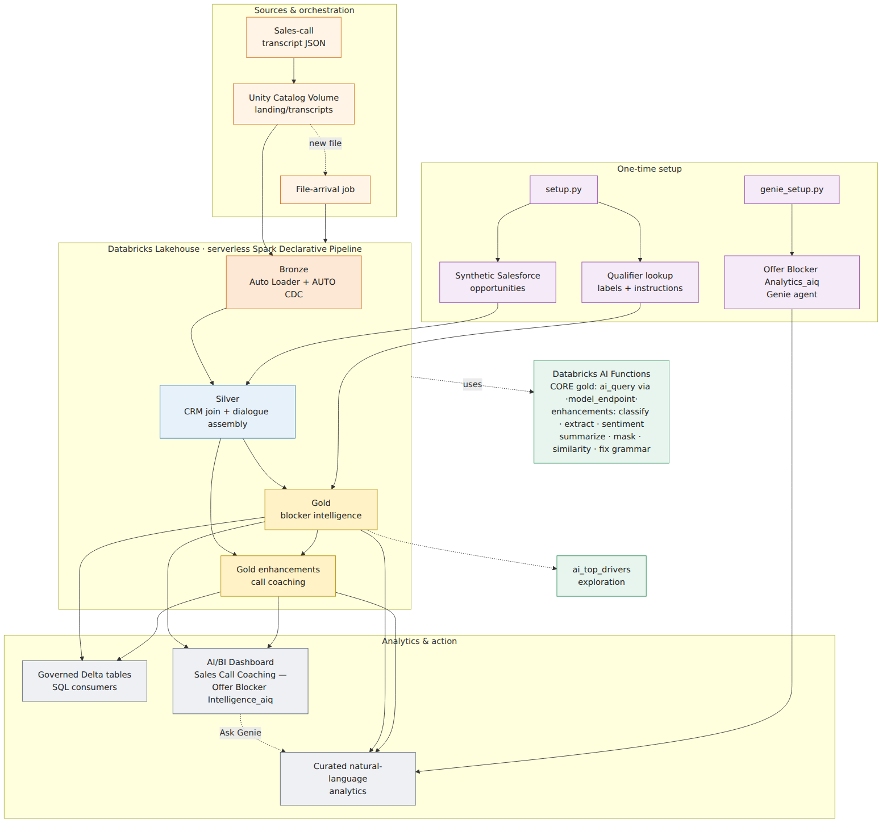
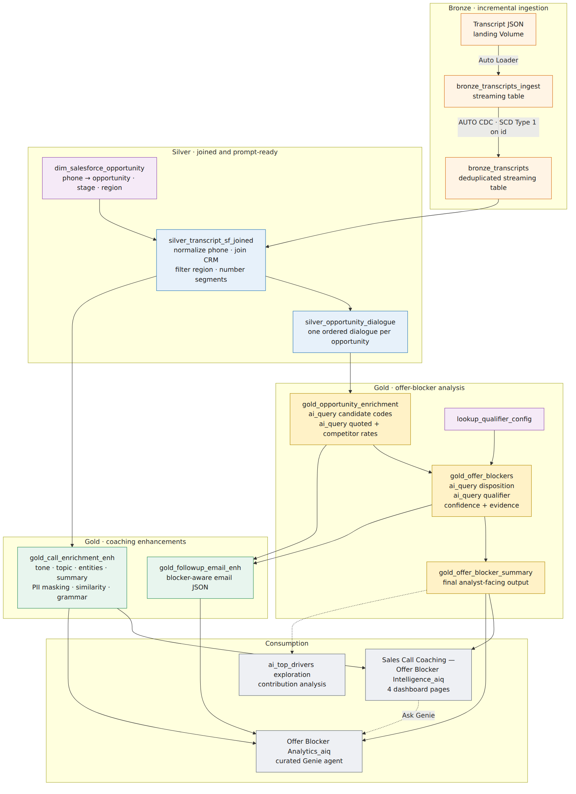

# Superior Plus Propane — Offer Blocker Intelligence

This repository turns Superior Plus Propane sales-call transcripts into structured offer-blocker intelligence on Databricks. It replaces a manual transcript-to-LLM workflow with a serverless Spark Declarative Pipeline, curated Genie agent, and multi-page AI/BI coaching dashboard.

The deployable project is [`superior-offer-blocker/`](superior-offer-blocker/).

## What it does

The solution:

1. Incrementally ingests transcript JSON with Auto Loader.
2. Deduplicates calls by ID using AUTO CDC.
3. Joins calls to synthetic Salesforce opportunities and assembles one dialogue per opportunity.
4. Uses Databricks AI Functions to classify blocker codes, extract quoted rates, assign dispositions and qualifiers, and enrich each call.
5. Publishes an analyst-friendly blocker summary, coaching signals, and generated follow-up emails.
6. Exposes the results through a curated Genie agent and AI/BI dashboard.

### Blocker taxonomy

| Code | Category | Examples |
|---|---|---|
| 4A | Rate competitiveness | High quoted rate, competitor comparison, price-match request |
| 4B | Ancillary fees | Delivery, rental, installation, inspection, or admin fees |
| 4C | Commercial model | Pre-buy, tank ownership, pricing mechanism, commitment length |
| 4D | Contract mechanics | Auto-renewal, exit terms, billing, or transaction process |
| 4E | Availability/serviceability | Coverage, product, equipment, site, or timeline gap |
| 4F | Promotion eligibility | Referral, threshold, ownership, timing, or policy restrictions |

## Current architecture



```text
Transcript JSON
    │
    ▼
bronze_transcripts_ingest ──AUTO CDC──▶ bronze_transcripts
                                                │
dim_salesforce_opportunity ─────────────────────┤
                                                ▼
                               silver_transcript_sf_joined
                                                │
                                                ▼
                               silver_opportunity_dialogue
                                                │
                                                ▼
                               gold_opportunity_enrichment
                                  │  ai_query: codes 4A–4F
                                  │  ai_query: quoted/competitor rates
                                  ▼
                                  gold_offer_blockers
                                  │  ai_query: disposition
lookup_qualifier_config ──────────┤  ai_query: qualifier
                                  ▼
                           gold_offer_blocker_summary

(The CORE gold transforms call a single configurable ${model_endpoint}
via ai_query, seeding each request with the prompt_offer_blocker text.)

Enhancements:
  silver_transcript_sf_joined ──▶ gold_call_enrichment_enh
  gold_opportunity_enrichment ──▶ gold_followup_email_enh
```



### Pipeline datasets

| Dataset | Type | Purpose |
|---|---|---|
| `bronze_transcripts_ingest` | Streaming table | Incrementally reads transcript JSON and records source metadata |
| `bronze_transcripts` | Streaming table | SCD Type 1 deduplication by call ID |
| `silver_transcript_sf_joined` | Materialized view | Normalizes phones, joins Salesforce opportunities, applies region filters, and numbers call segments |
| `silver_opportunity_dialogue` | Materialized view | Produces one ordered, prompt-ready dialogue per opportunity |
| `gold_opportunity_enrichment` | Materialized view | Classifies candidate blocker codes and extracts structured quoted/competitor rates |
| `gold_offer_blockers` | Materialized view | Classifies disposition and code-specific qualifier, with confidence and evidence |
| `gold_offer_blocker_summary` | Materialized view | Final spreadsheet-style blocker output used by the dashboard and Genie |
| `gold_call_enrichment_enh` | Materialized view | Adds tone, topic, CRM entities, summary, masking, similarity, and grammar signals per call |
| `gold_followup_email_enh` | Materialized view | Generates a concise blocker-aware follow-up email per opportunity |

### AI Functions

The current implementation uses:

- `ai_query` against the configurable `${model_endpoint}` (default
  `databricks-claude-opus-4-8`) for the CORE gold path — blocker codes 4A–4F,
  quoted/competitor rate extraction, disposition, and qualifier — each request
  seeded with the shared prompt from the `prompt_offer_blocker` table and
  constrained to a strict JSON schema. This replaced the earlier
  `ai_classify`/`ai_extract` calls in those transforms.
- `ai_query` for the structured follow-up email enhancement.
- `ai_classify` for call topics and `ai_extract` for CRM-style entities in the
  `_enh` call-coaching transform.
- `ai_analyze_sentiment` for customer tone.
- `ai_summarize` and `ai_mask` for concise, PII-safe call summaries.
- `ai_similarity` and `ai_fix_grammar` for coaching-oriented enrichment.
- `ai_top_drivers` in the exploratory notebook for contribution analysis.

Swapping the model for the entire CORE path is a single change to the
`model_endpoint` bundle variable — no SQL edits required.

## Analytics experiences

### Genie agent

- Name: **Offer Blocker Analytics_aiq**
- Workspace ID: `01f19cba5b581c9a81e28d0502069ec6`
- Version-controlled definition: [`superior-offer-blocker/genie/genie_agent.json`](superior-offer-blocker/genie/genie_agent.json)
- Coverage: six curated tables, six sample questions, 17 example SQL questions, consolidated instructions, and a benchmark.

The setup job provisions or updates the agent from the checked-in JSON.

### AI/BI dashboard

- Name: **Sales Call Coaching — Offer Blocker Intelligence_aiq**
- Source workspace ID: `01f1a70334b0114384592a2536bbe4f2`
- Version-controlled definition: [`superior-offer-blocker/src/dashboards/offer_blocker.lvdash.json`](superior-offer-blocker/src/dashboards/offer_blocker.lvdash.json)
- Pages: Executive Overview, Call Intelligence & Coaching, Global Filters, and AI Insights.
- Datasets: blocker findings, call enrichment, and competitive intelligence.
- The dashboard links to the curated Genie agent above.

The dashboard was created manually and then imported into the bundle source. Before a future deployment to the existing development target, explicitly bind the DAB resource key `offer_blocker_dashboard` to the dashboard ID above. Otherwise, the existing bundle state may still target the older dashboard.

## Repository layout

```text
.
├── README.md
├── docs/                              Architecture and data-flow diagrams
├── examples/                          Sanitized inputs and reference outputs
├── original/                          Original hand-written Python workflow
└── superior-offer-blocker/
    ├── databricks.yml                 Bundle variables and development target
    ├── README.md                      Bundle-level overview
    ├── resources/
    │   ├── offer_blocker.pipeline.yml Serverless SDP definition
    │   ├── offer_blocker.job.yml      File-arrival pipeline job
    │   ├── setup.job.yml              Setup and Genie provisioning job
    │   └── offer_blocker.dashboard.yml
    ├── pipeline/
    │   ├── transformations/
    │   │   ├── bronze/
    │   │   ├── silver/
    │   │   └── gold/
    │   └── explorations/
    │       └── ai_top_drivers_exploration.py
    ├── src/
    │   ├── setup/
    │   │   ├── setup.py
    │   │   └── genie_setup.py
    │   └── dashboards/
    │       └── offer_blocker.lvdash.json
    ├── genie/
    │   └── genie_agent.json
    ├── data/
    │   └── batch_b_ny_001.json
    └── seeds/
        ├── code_categories.csv
        └── offer_blocker_prompt_v6.txt
```

## Setup objects

The `setup_job` creates or refreshes:

- The Unity Catalog `landing` volume and `landing/transcripts` directory.
- The bundled sample transcript in the landing directory.
- `dim_salesforce_opportunity`, a deterministic synthetic CRM mapping for the demo.
- `lookup_qualifier_config`, which contains code-specific labels and instructions for qualifier classification.
- The one-row `prompt_offer_blocker` table, seeded from `seeds/offer_blocker_prompt_v6.txt`, whose text every CORE `ai_query` call prepends to its request.
- The **Offer Blocker Analytics_aiq** Genie agent from the checked-in definition.

## Bundle configuration

The default development configuration uses:

| Variable | Default |
|---|---|
| `catalog` | `dbw_brlui_stable` |
| `schema` | `call_transcripts_poc_aiq` |
| `model_endpoint` | `databricks-claude-opus-4-8` |
| `warehouse_id` | `50ad3a9993503e5b` |
| `prompt_version` | `v6` |
| `region_1` / `region_2` | `New York` / `New Jersey` |
| `input_multiline` | `true` |

`model_endpoint` is now published into the pipeline configuration and consumed by every CORE `ai_query` call as `${model_endpoint}`, so the model can be swapped with no SQL change. Note: the batch-supported endpoint requirement still applies (see the variable's description in `databricks.yml`). `batch_label` remains declared but is not passed into the pipeline; the analyst output derives its `Batch` column from the source filename.

## Validate and run

Choose the Databricks CLI profile explicitly; never rely on implicit profile selection.

```bash
cd superior-offer-blocker

PROFILE=<your-profile>

databricks bundle validate --strict --target dev --profile "$PROFILE"
databricks bundle deploy --target dev --profile "$PROFILE"
databricks bundle run setup_job --target dev --profile "$PROFILE"
databricks bundle run offer_blocker_pipeline --target dev --profile "$PROFILE"
```

Dropping another JSON file into the configured landing volume triggers `offer_blocker_ingest_job`. Development-mode deployments keep its file-arrival trigger paused unless explicitly enabled.

## Notes

- The included Salesforce opportunity data is synthetic and intended for demonstration.
- The sample file is a JSON array, so `input_multiline=true`; use `false` for JSON Lines input.
- The current pipeline source root is `pipeline/`, and only `pipeline/transformations/**` is included as pipeline code. Exploratory notebooks are retained beside it but are not executed by the pipeline.
- Workspace-authored source, Genie, dashboard, job, and pipeline changes were reconciled into this repository without deploying or modifying workspace resources.
